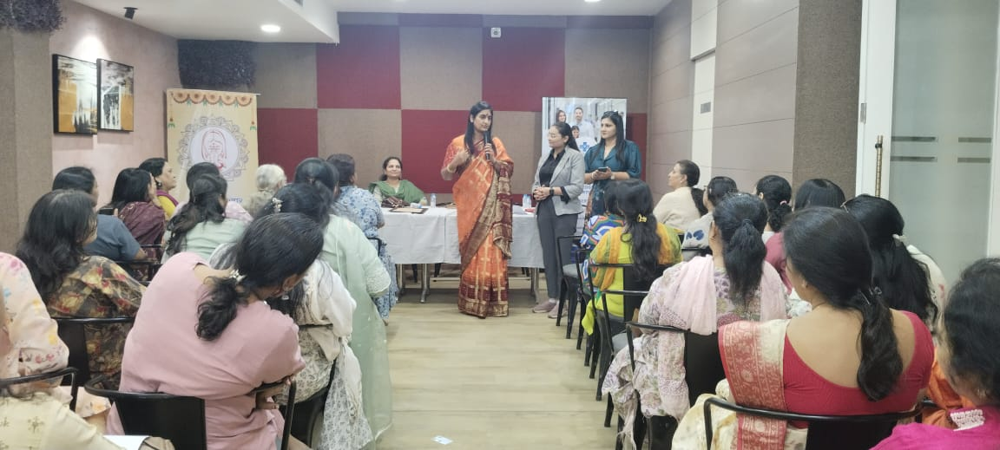
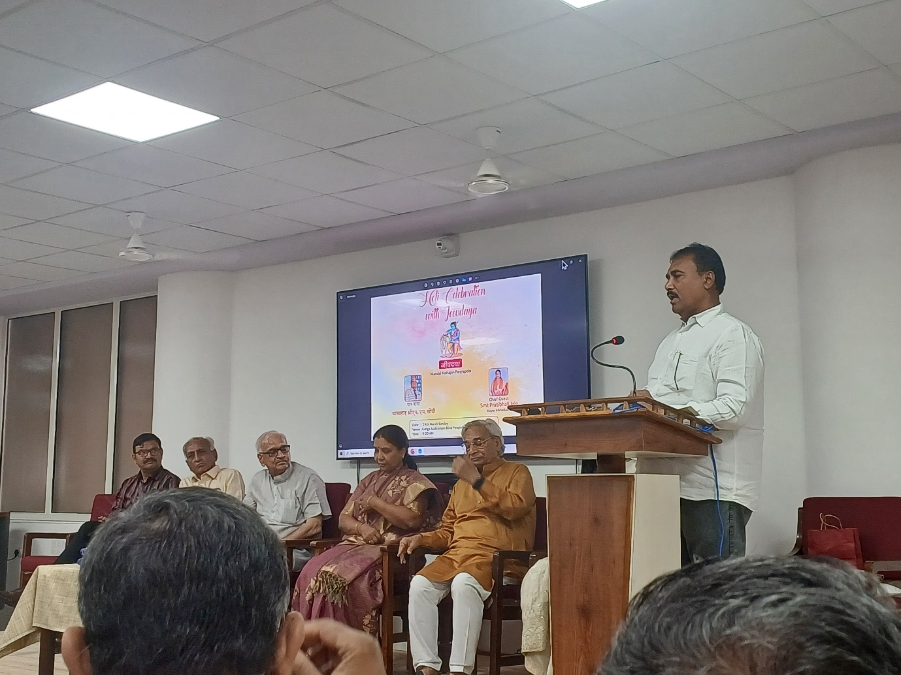
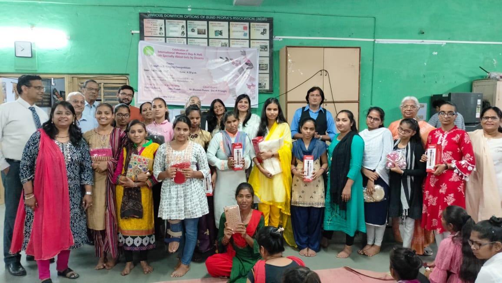
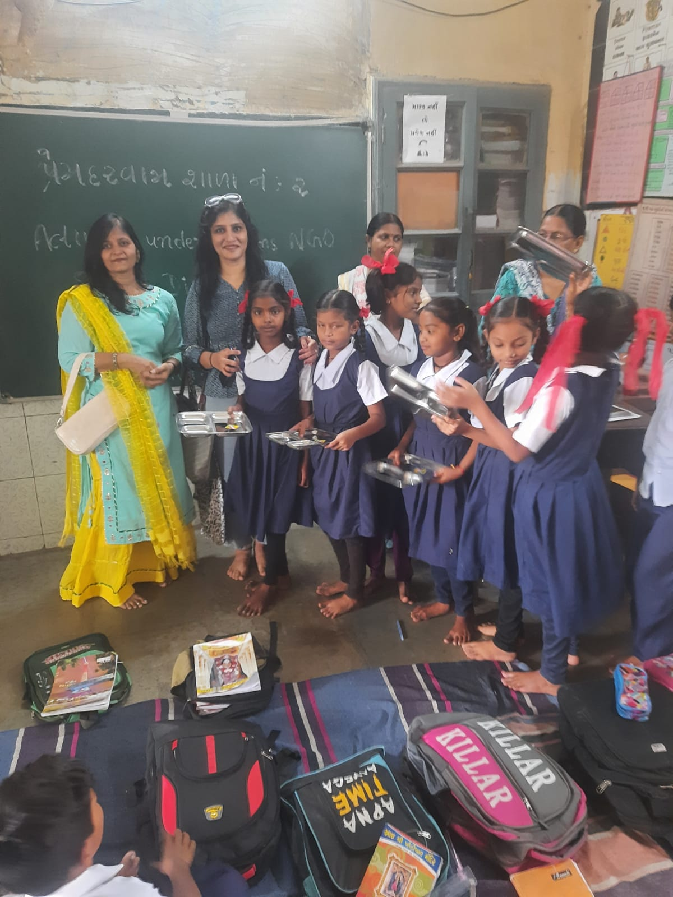
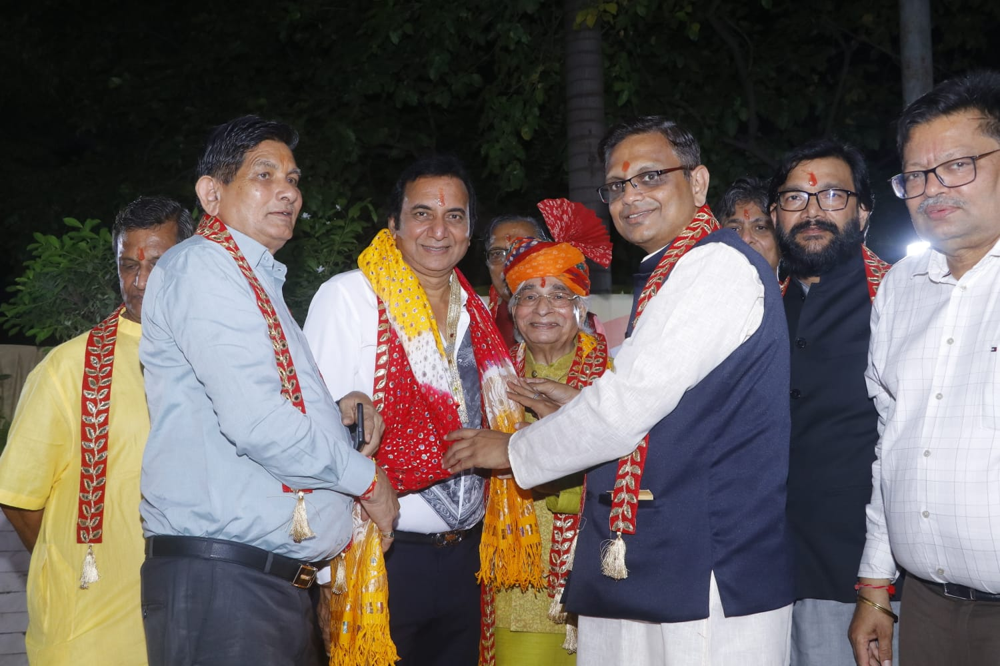
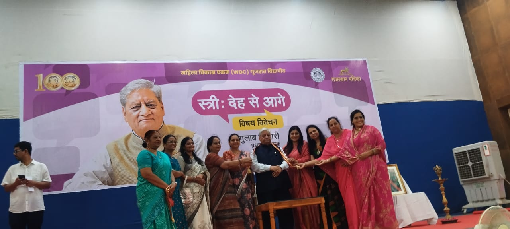
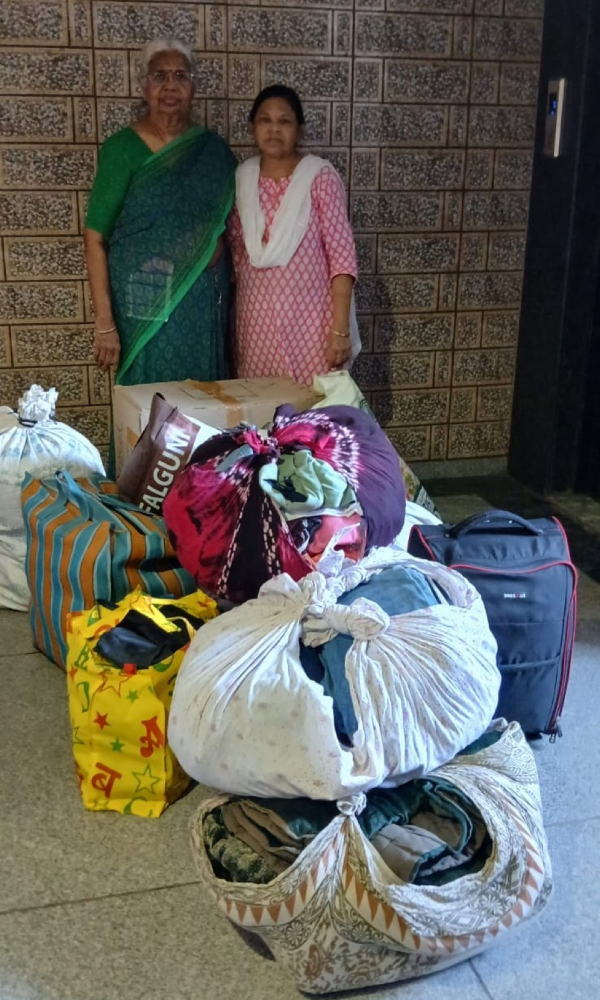

{width="6.268055555555556in"
height="2.823611111111111in"}

Educative session for women on pre‑ and post‑menopause care, cervical
cancer awareness, and essential medical hygiene, conducted by experts
from Lilavati Hospital, Gandhinagar.

{width="6.268055555555556in"
height="4.700694444444444in"}

Arranged a seminar addressing the growing impact of rapid urbanisation
and climate change on animal life, attended by dignitaries including the
trustees of Mandal Panjra Pole, Ahmedabad Mayor Smt. Pratibha Jain, Dr.
Bhushan Punani of the Blind People's Association, Dr. M. M. Singhi, and
Deepak Jain from Bluecity Positive Forum.

{width="6.268055555555556in"
height="3.535416666666667in"}

A capacity‑building session for young women, designed to enhance soft
skills and strengthen public speaking abilities.

{width="6.268055555555556in"
height="4.701388888888889in"}

Arranged "UDAAN" Youth Empowerment Camp for Specially Abled Citizens at
Jodhpur, Rajasthan with DORAI Foundation.

{width="6.268055555555556in"
height="8.35763888888889in"}

Basic infrastructure development support provided to the Ahmedabad
Municipal Primary School at Prem Darwaja.

{width="6.268055555555556in"
height="4.178472222222222in"} Organise an interactive session with
esteemed Marwari motivational speaker Shri Shantilalji Golecha focused
on preserving our traditions and cultural values with young
participants.

{width="6.268055555555556in"
height="2.8208333333333333in"}

Actively collaborated with Rajasthan Patrika in organising an in‑depth
discussion and analysis on women's empowerment in India.

{width="4.813825459317585in"
height="8.010416666666666in"}

A community collection drive to gather unused household materials and
electronic items from different localities of Ahmedabad city for
distribution to underprivileged citizens this Deepawali.
